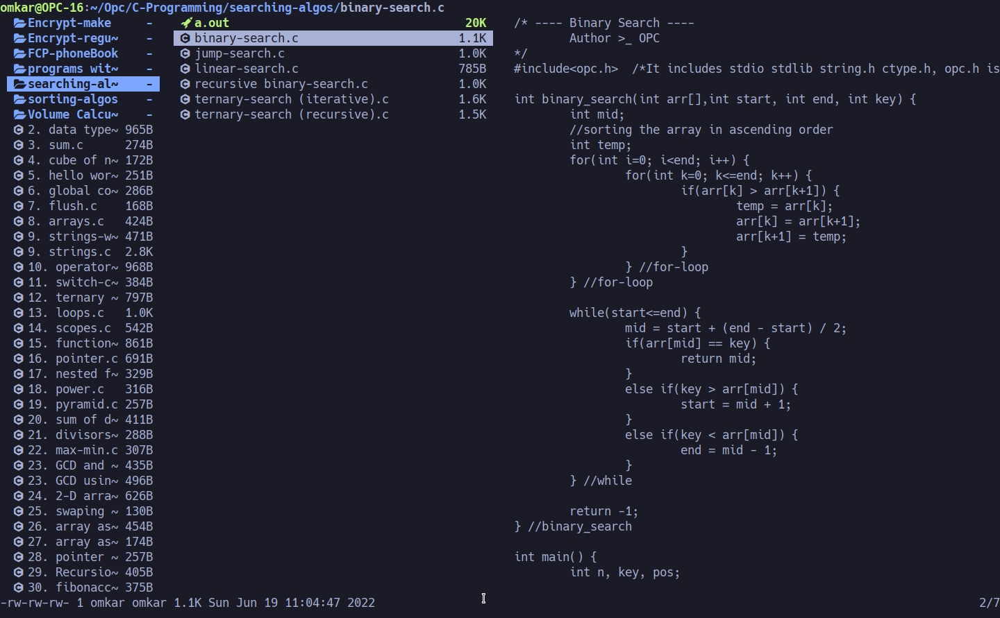

# LF

`lf` (for 'list files') is a terminal file manager written in [Go](https://github.com/golang/go).

It is inspired by [ranger](https://github.com/ranger/ranger), a python-written older terminal file manager.

### Link to LF -> https://github.com/gokcehan/lf
