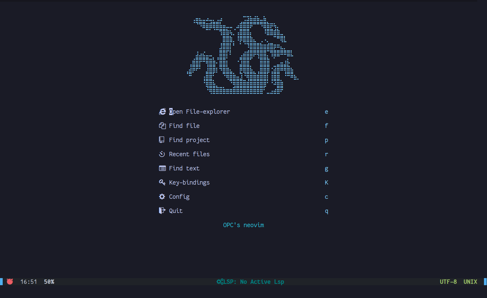

# Vim 📝

Vim is a greatly improved version of the good old UNIX editor [Vi](https://en.wikipedia.org/wiki/Vi).

Here are few basic commands and keybindings for vim, which will work in [Neovim](https://github.com/neovim/neovim) too.

---

### Vim's Official website https://www.vim.org/

### Vim's GitHub https://github.com/vim/vim)
